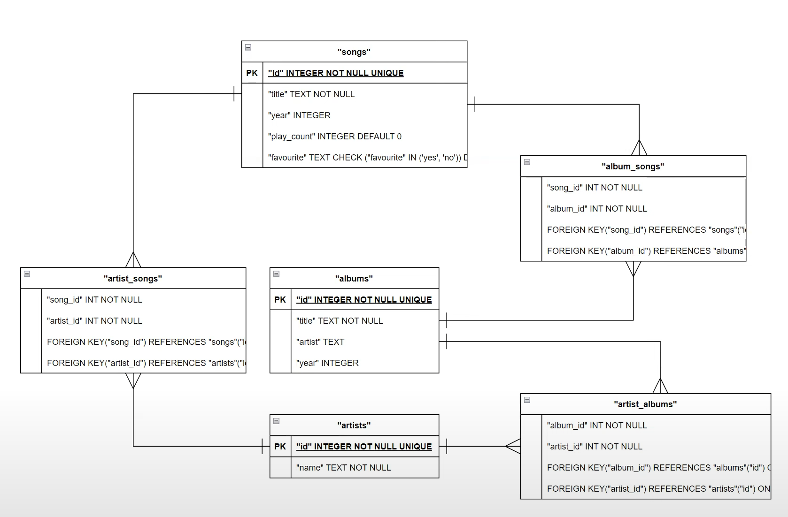

PROJECT TITLE: MUSIC LIBRARY DATABASE
NAME: ELISEI PROFIR
GITHUB & EDX USERNAME: proelisei
CITY & COUNTRY: Brasov, Romania
RECORDING DATE: 27th of June 2024

# Design Document

By ELISEI PROFIR

Video overview: https://youtu.be/j2UfHZsUe5M

## Scope

The database is designed to efficiently manage a digital music library, encompassing songs, albums, and artists. It facilitates detailed tracking of play counts, favorite status, and associations between songs, albums, and artists.

Out of scope are elemnets like playlists, streaming platforms, genre and other non-core atributes.

## Functional Requirements

This database system supports a comprehensive set of functionalities essential for managing a digital music collection:

* **CRUD Operations**: The system allows users to create, read, update, and delete records for songs, albums, and artists. This functionality ensures flexibility in managing the music library's content.

* **Association Management**: Songs can be associated with multiple albums and artists, reflecting real-world scenarios where songs may appear in various albums or involve collaborations between multiple artists.

* **Play Count Tracking**: The database tracks the number of times each song has been played, providing valuable insights into user preferences and popular music within the library.

* **Favorite Marking**: Users can mark songs as favorites, enabling quick access to preferred tracks and personalizing their music listening experience.

## Representation

### Entities

#### Songs Table

The `songs` table serves as the core entity capturing detailed information about each song in the library:

* `id` INTEGER PRIMARY KEY: Unique identifier for the song, ensuring each entry is uniquely identifiable.
* `title` TEXT NOT NULL: The title of the song.
* `year` INTEGER: The year of release for the song.
* `play_count` INTEGER DEFAULT 0: Tracks the number of times the song has been played, initializing at 0 and incrementing with each play.
* `favourite` TEXT CHECK ('yes', 'no') DEFAULT 'no': Indicates whether the song is marked as a favorite by users, with possible values 'yes' or 'no'.

#### Albums Table

The `albums` table stores information related to albums available in the library:

* `id` INTEGER PRIMARY KEY: Unique identifier for the album, ensuring each entry is uniquely identifiable.
* `title` TEXT NOT NULL: The title of the album.
* `artist` TEXT: The name of the artist or band responsible for creating the album.
* `year` INTEGER: The year of release for the album.

#### Artists Table

The `artists` table contains details about individual artists or bands featured in the music library:

* `id` INTEGER PRIMARY KEY: Unique identifier for the artist, ensuring each artist is uniquely identifiable within the system.
* `name` TEXT NOT NULL: The name of the artist or band, serving as the primary identifier for artists across the music collection.

### Relationships

The database schema defines robust relationships between songs, albums, and artists, facilitating comprehensive organization and navigation within the digital music library:

* **Songs to Albums**: Each song can belong to multiple albums, reflecting album compilations, re-releases, and various artist albums.
* **Songs to Artists**: Each song can be associated with multiple artists, accommodating collaborations and featuring arrangements across different musical works.
* **Albums to Artists**: Each album can involve multiple artists in its creation, capturing diverse artist contributions and collaborative efforts.

#### album_songs

The `album_songs` table manages the relationship between albums and songs, facilitating the organization of songs within albums:

* `song_id` INTEGER NOT NULL: Foreign key referencing the `id` column in the `songs` table, establishing a link between songs and albums.
* `album_id` INTEGER NOT NULL: Foreign key referencing the `id` column in the `albums` table, establishing a link between albums and songs.
* PRIMARY KEY (`song_id`, `album_id`): Ensures each song can be associated with multiple albums, maintaining data integrity and supporting efficient query operations.

#### artist_songs

The `artist_songs` table establishes relationships between artists and songs, capturing collaborations and featuring arrangements:

* `song_id` INTEGER NOT NULL: Foreign key referencing the `id` column in the `songs` table, establishing a link between songs and artists.
* `artist_id` INTEGER NOT NULL: Foreign key referencing the `id` column in the `artists` table, establishing a link between artists and songs.
* PRIMARY KEY (`song_id`, `artist_id`): Allows each song to be associated with multiple artists, accommodating collaborative works and featuring arrangements.

#### artist_albums

The `artist_albums` table manages associations between artists and albums, reflecting artist contributions to specific albums:

* `album_id` INTEGER NOT NULL: Foreign key referencing the `id` column in the `albums` table, establishing a link between albums and artists.
* `artist_id` INTEGER NOT NULL: Foreign key referencing the `id` column in the `artists` table, establishing a link between artists and albums.
* PRIMARY KEY (`album_id`, `artist_id`): Enables each album to be attributed to multiple artists, supporting diverse artist collaborations and contributions.

## Optimizations

To optimize database performance and enhance query efficiency, the system incorporates indexing on critical columns:

* **Index on Songs**: `songs_index` on `id` and `title` columns to expedite searches and retrieval of songs by ID or title, enhancing user experience and query response times.
* **Index on Albums**: `albums_index` on `title` column to facilitate rapid access to albums by title.
* **Index on Artists**: `artists_index` on `name` column to streamline searches for artists by name.

The `favourite_songs` view simplifies access to songs marked as favorites within the music library.

## Limitations

The current database schema has specific limitations that may impact its flexibility and scalability:

* The schema assumes one-to-many relationships between songs and albums/artists. Future enhancements to support many-to-many relationships would require additional tables and schema adjustments to accommodate diverse music collaboration scenarios.
* The database design focuses primarily on managing music metadata and relationships, excluding advanced features such as user playlists, ratings, or streaming capabilities.

## Conclusion

This comprehensive database design effectively addresses the requirements for managing a digital music library, providing a scalable and efficient solution for organizing, accessing, and navigating music collections. With support for CRUD operations, detailed relationship management, and strategic indexing, the database ensures optimal performance and user experience, catering to diverse music library needs.
